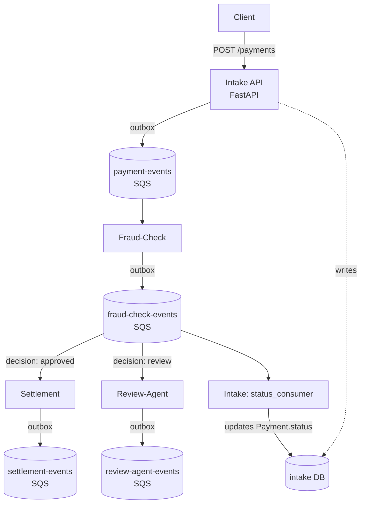

# Payment Settlement Platform

A distributed, event-driven payment settlement system built to demonstrate
production-grade microservice architecture patterns on AWS: database-per-service,
the transactional outbox pattern, at-least-once message delivery, and
idempotent, retry-safe consumers.

## Architecture

Each service owns its own database and communicates with the others
exclusively through published events — never by querying another
service's database directly. This keeps services independently
deployable and prevents tight coupling through shared schemas.



**Services built so far:**

| Service | Responsibility | Own DB | Consumes | Publishes |
|---|---|---|---|---|
| **Intake** | Accepts payment requests (FastAPI), idempotent writes | `intake` | — | `PaymentCreated` |
| **Fraud-Check** | Scores each payment, decides `approved`/`review` | `fraud_check` | `payment-events` | `FraudCheckCompleted` |
| **Settlement** | Settles `approved` payments | `settlement` | `fraud-check-events` (filtered: `approved`) | `SettlementCompleted` |
| **Review-Agent** | Opens a case for `review` payments | `review_agent` | `fraud-check-events` (filtered: `review`) | `ReviewCaseOpened` |
| **Intake (status consumer)** | Reflects the fraud decision back onto the original payment | `intake` | `fraud-check-events` | — |

## Design patterns

**Transactional outbox.** Every service writes its own data row and a
corresponding event row in the *same* database transaction. This
guarantees that an event is never lost and never published for a row
that didn't actually get saved — the two either both commit or both
roll back.

**At-least-once delivery.** A separate relay process (built to run as
a scheduled Lambda) polls each service's outbox table for unpublished
rows, sends them to SQS, and only then marks them published. If the
relay crashes mid-batch, some events may be sent twice on the next
run — this is accepted and handled by making every consumer
idempotent, not by trying to guarantee exactly-once delivery (which
distributed systems generally can't do cheaply).

**Idempotent consumption.** Every consumer only deletes a message
from its queue after successfully committing the result of processing
it. A crash between receiving and committing means the message
becomes visible again after SQS's visibility timeout and gets
retried — safe, because processing the same event twice produces the
same result (e.g. Intake's `/payments` endpoint checks `idempotency_key`
before creating a duplicate `Payment`).

**Eventual consistency across service boundaries.** `Payment.status`
does not update synchronously when a fraud decision is made — it
updates asynchronously, once Intake's status consumer processes the
relevant event. This is a deliberate tradeoff: strict consistency
here would require synchronous coupling between services that
otherwise don't need to know about each other.

## Local development

All infrastructure runs locally via Docker — three Postgres instances
(one per service that needs one) and [LocalStack](https://localstack.cloud)
emulating AWS SQS, so the same `boto3` code that talks to LocalStack
today will talk to real AWS SQS once deployed, with only an endpoint
URL changing.

```bash
docker-compose up -d
```

Each service has its own virtual environment and `requirements.txt`,
matching how they'd be deployed independently (e.g. as separate Lambda
functions) in production.

```bash
cd services/<service-name>
python -m venv .venv
source .venv/bin/activate
pip install -r requirements.txt
alembic upgrade head
```

Intake also runs a FastAPI server:
```bash
cd services/intake
uvicorn main:app --reload --port 8001
```

Each service's consumer and relay can be run directly for local testing:
```bash
python consumer.py
python relay.py
```

## Deployment status

**Intake is fully deployed on real AWS**, provisioned via Terraform
(`infra/intake/`) — not just LocalStack. Live components:

- RDS (Postgres) for the `intake` database, inside the default VPC,
  not publicly accessible (only reachable from Lambda via a security
  group rule)
- Two Lambda functions: `intake-api` (the FastAPI app, via a
  [Mangum](https://mangum.io) adapter) and `intake-relay` (the outbox
  poller, triggered every minute via an EventBridge schedule)
- API Gateway (HTTP API) exposing `intake-api` over a public URL
- A real SQS queue (`payment-events`)

A one-off `intake-migrate` Lambda was used to apply Alembic migrations
against RDS from inside the VPC, since the database has no public
network access and neither Terraform nor a local machine can reach it
directly — this preserves the same access boundary Lambda uses in
production, rather than temporarily opening RDS to the internet.

**Fraud-Check, Settlement, and Review-Agent are not yet deployed** —
they currently only run locally against Docker/LocalStack. The plan
is to repeat the same Terraform pattern (RDS + Lambda + SQS) for each.

## Fraud scoring: current state and planned evolution

Fraud-Check currently uses a simple rules-based stub (flag anything
over a fixed amount threshold as `review`) to prove out the service's
plumbing — SQS consumption, atomic outbox writes, at-least-once
delivery — independently of the scoring logic itself.

**Planned:** replace the stub with an XGBoost propensity model for
the initial fraud score, matching the approach used in production
fintech risk systems.

## Review-Agent: current state and planned evolution

Review-Agent currently just records and parks any payment flagged
`review` by Fraud-Check, with a status of `pending_review` — proving
the event-routing and atomic-write pattern without yet making an
actual triage decision.

**Planned:** an LLM-based reasoning layer, backed by retrieval-augmented
generation (RAG) over FCA and CIFAS fraud-indicator criteria, to
produce an actual triage outcome per case (auto-clear, escalate to a
human reviewer, or request additional information) rather than
parking every flagged case indefinitely. This is intentionally a
separate AI/ML component from the XGBoost scoring model above: XGBoost
produces the *initial* score that decides `approved` vs `review`,
while the LLM/RAG layer reasons over cases *after* they've already
been flagged — two distinct techniques solving two distinct problems
in the same pipeline.

## Planned but not yet built

**Deployment**
- Terraform for Fraud-Check, Settlement, and Review-Agent, following
  the same pattern already proven with Intake

**AI/ML**
- XGBoost propensity model to replace Fraud-Check's rules-based stub
- LLM/RAG layer for Review-Agent (see above)

**Open architecture question**
- Whether to add an AWS Step Functions saga for Settlement, to support
  compensating transactions (automatic rollback if a later step in the
  flow fails). The current design is event choreography — each
  service reacts independently to events with no central orchestrator
  and no rollback capability. This is a legitimate, real pattern in
  its own right, but a saga would be a meaningfully different
  (arguably more advanced) approach worth demonstrating separately.

**Other services**
- **Ledger** — double-entry bookkeeping record of settled funds
- **Reconciliation** — Lambda + EventBridge, matching settlement
  records against external sources of truth
- **Notifications** — Lambda + SQS, signed webhooks on status changes

**Operational readiness**
- **CI/CD** — GitHub Actions: test/lint/terraform-plan on push,
  build and push Docker images to ECR, deploy to ECS on merge to main
- **IAM scoping** — the `terraform-deploy` IAM user currently has
  full `AdministratorAccess` for setup convenience; needs tightening
  to least-privilege before this is genuinely production-shaped
- **Automated tests** — none written yet, anywhere in the project
- **Cost awareness** — RDS is billed hourly regardless of use, unlike
  Lambda/SQS which cost ~nothing at rest; worth `terraform destroy`
  between extended breaks if cost becomes a concern